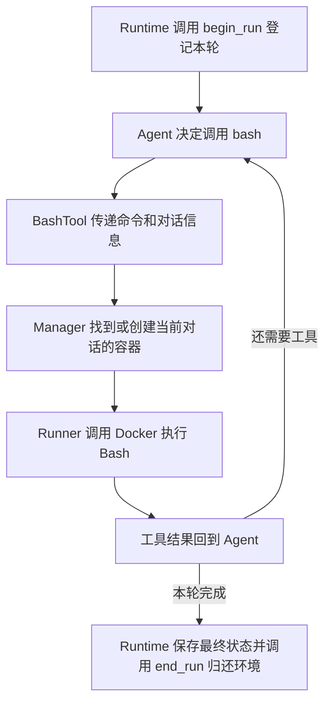

# 从一次真实文件任务读懂 sandbox

这个目录解决的是：Agent 决定运行命令后，怎样给它准备当前对话的执行环境、运行命令、拿到结果，并在任务结束后处理这个环境。

例如，你让 Agent 读取一份资料并生成结果。模型选择调用 `bash`，命令在容器里读取 `uploads/input.txt`，把结果写到 `outputs/result.txt`。容器可以理解为服务器中划出的一间工作室；当前对话的三个目录，是工作室能够访问的文件入口。

这里假设资料已经放进该对话的 `uploads`。目前浏览器上传接口仍将文件放在 `workspace`，上传接口的目录迁移是另外一步；下面专门说明沙箱接收到文件后如何工作。

## 先沿一条调用链读



Thread 是一段对话，Run 是这段对话的一轮执行。同一个 Thread 可以先后执行多个 Run。模型可能在一个 Run 里调用多次工具，也可能直接回答而一次工具都不用。

Runtime 负责这轮执行的整体流程，Agent 负责模型与工具之间的循环，BashTool 把统一的工具调用交给执行器。读文件结果、保存消息、确认 Run 成败等职责仍在原来的上游流程中。

## 文件分别做什么

按表中的顺序阅读。每个函数内部都先说明接收什么、返回什么，再逐行解释实现。

| 文件 | 解决的问题 | 先看哪里 |
| --- | --- | --- |
| `/home/pl/deer_mini/backend/app/sandbox/base.py` | 工具与执行器之间需要传什么、返回什么 | `CommandResult` 的四个字段 |
| `/home/pl/deer_mini/backend/app/sandbox/models.py` | 一段对话的容器当前处于什么状态 | `SandboxEntry` 的各个字段 |
| `/home/pl/deer_mini/backend/app/sandbox/manager.py` | 谁领取容器，什么时候复用、归还、回收 | `begin_run()` → `run()` → `end_run()` |
| `/home/pl/deer_mini/backend/app/sandbox/docker_runner.py` | 怎么拼参数、调用 Docker、读取输出、处理超时 | `build_run_args()` → `start_container()` → `run_in_container()` |
| `/home/pl/deer_mini/backend/app/sandbox/__init__.py` | 其他模块怎样导入这里提供的名字 | 导入语句和 `__all__` |

## 用同一组信息跟一次任务

假设用户叫 `alice`，对话是 `t1`，第一轮是 `run-101`，服务器上的目录是 `/data/t1/workspace`。这里的 `/data/t1` 是为了读起来清楚而使用的例子。

| 名字 | 本例的值 | 为什么要传它 |
| --- | --- | --- |
| `user_id` | `alice` | 确认这是谁的任务，与对话 ID 一起区分记录 |
| `thread_id` | `t1` | 找到这段对话独立的文件与容器记录 |
| `run_id` | `run-101` | 确认当前这轮已领取该对话的执行环境 |
| `workspace_path` | `/data/t1/workspace` | 在服务器找到三个真实目录；这项仍然是服务器路径 |
| `tool_call_id` | `call-001` | 区分模型的这一次工具调用；同一轮可能有多次调用 |
| `command` | `cp ../uploads/input.txt ../outputs/result.txt` | 指定这次在容器内执行什么 |

这条命令里的 `cp` 是复制文件程序。它接收来源路径和目标路径。命令从容器的 `workspace` 开始，`..` 表示回到上一层，所以 `../uploads` 和 `../outputs` 分别指向旁边的两个目录。

### 第一处：登记使用权

Runtime 调用 `manager.begin_run(...)`。管理器把 `user_id` 和 `thread_id` 组成字典键 `("alice", "t1")`，找到这段对话的登记卡。

如果没有旧卡，就创建 `SandboxEntry`，其中 `container_id=None` 表示还没有创建容器。随后将 `active_run_id` 写成 `run-101`，把卡放进 `_active`。

此时只是登记。如果模型直接回答，这轮就不需要创建 Docker 容器。

### 第二处：第一次 Bash 才准备容器

BashTool 调用 `manager.run(...)`。管理器先确认登记卡上的使用者就是 `run-101`，并确认服务器目录一致。

看到 `container_id=None` 后，管理器生成一个容器名称，先写在卡上，再调用 `runner.start_container(...)`。提前记下名字，是为了创建途中被取消时仍知道应该清理谁。

Runner 把三个目录挂进同一个容器，并用 `sleep infinity` 作为保持容器运行的主进程。它随后通过 `docker exec` 在该容器里启动新的 Bash，执行这次命令。

### 第三处：把结果交回模型

Runner 同时等待命令退出和读取命令输出，最后返回 `CommandResult`。

`output` 是输出文字，`exit_code` 是退出码，`timed_out` 说明有没有超时，`output_truncated` 说明过长输出有没有被截断。

BashTool 将它整理为统一工具结果。工具执行器把结果交回 Agent，Agent 将工具结果放入消息，并继续调用模型。SQLite 的关键状态保存仍由 Agent 和 Runtime 的原有协作完成。

例子中的 `cp` 成功时通常不打印文字，所以文件复制成功也可能得到空 `output`。要显示文件内容，需要接着调用 `cat ../outputs/result.txt`。命令输出和磁盘文件是两种不同的结果。

### 第四处：归还，等待下一轮

Runtime 在本轮收尾时调用 `manager.end_run(...)`。管理器把卡从 `_active` 移到 `_warm_pool`，清空 `active_run_id`，记录开始闲置的时刻。

`_warm_pool` 是空闲容器集合，可以理解为暂时归还、下一次还能借用的工作室。下一轮 `run-102` 可以重新领取同一张卡和同一个容器。

| 时刻 | 登记卡在哪里 | `active_run_id` | `container_id` |
| --- | --- | --- | --- |
| 第一轮刚登记 | `_active` | `run-101` | `None`，尚未创建 |
| 第一条 Bash 开始 | `_active` | `run-101` | 容器 A 的名称 |
| 第一轮归还 | `_warm_pool` | `None` | 仍是容器 A |
| 第二轮领取 | `_active` | `run-102` | 继续使用容器 A |
| 闲置回收成功 | 登记被移除 | 没有占用者 | 容器 A 已删除 |

一轮完全没用 Bash，或者容器已经因超时清理掉了，归还时就无需保留空闲容器记录。

## 两套路径怎样对应

```text
服务器上的 Thread 目录
/data/t1/
├── workspace/    脚本和工作过程文件
├── uploads/      提供给 Agent 的资料
└── outputs/      需要保留或交付的结果
```

| 服务器路径，即 `source` | 容器路径，即 `target` |
| --- | --- |
| `/data/t1/workspace` | `/mnt/user-data/workspace` |
| `/data/t1/uploads` | `/mnt/user-data/uploads` |
| `/data/t1/outputs` | `/mnt/user-data/outputs` |

“挂载”给同一份文件建立另一个访问入口。例如容器往 `/mnt/user-data/outputs/result.txt` 写内容，服务器通过 `/data/t1/outputs/result.txt` 就能看到它。移除容器后，这个服务器文件仍然存在。

容器的 `/tmp` 则是另外准备的临时存储。同一容器复用时可以继续使用，容器被移除后，里面的数据不会像三个服务器挂载目录那样保留。

每次 `docker exec` 都启动新的 Bash。上次的 `cd` 或 `export` 是那次 Shell 的状态，下次不会自动继承；每次的初始目录都明确设为 `/mnt/user-data/workspace`。

`read_file` 使用同一套虚拟目录名称，但它由后端把路径转换成服务器文件路径来读取。本目录负责 Bash 的执行环境，`read_file` 的具体实现位于 `/home/pl/deer_mini/backend/app/tools/read_file.py`。

## 异步代码里的几个词，放回本例理解

| 写法 | 在这个项目中意味着什么 |
| --- | --- |
| `async def` | 这个函数可能需要等待 Docker 或其他任务，调用方用 `await` 等它完成 |
| `await` | 当前操作暂时等结果，事件循环可以安排其他任务；不代表自动新开线程 |
| `asyncio.create_task(...)` | 安排一个可以与其他异步任务交替执行的任务，并保存引用用于等待、取消或读取结果 |
| `asyncio.Lock()` | 同一段对话一次只让一段相关代码修改或使用它的容器记录 |
| `async with lock` | 进入时等待拿锁，离开这个块时释放；块内的 `await` 不会自动释放这把锁 |
| `asyncio.wait_for(..., timeout=60)` | 这个等待超过 60 秒就报告超时；停止客户端、清理容器仍需要额外代码和时间 |
| `task.cancel()` | 请求任务取消，通常在它下次等待时收到 `CancelledError`；不是直接删除容器 |
| `asyncio.shield(task)` | 保护内部任务不跟着外层等待者的取消而直接取消；外层仍可能收到取消异常 |
| `finally` | 离开对应 `try` 的正常或异常路径时，仍需要执行的收尾部分 |
| `raise` | 继续向调用方报告错误或取消；`raise ... from error` 还能保留原始原因 |

锁按 `("alice", "t1")` 分配。t1 的命令还没结束时，另一段操作 t1 的代码需要等锁；t2 使用另外一把锁，可以继续处理自己的工作。

## 为什么读取输出、停止客户端、删除容器要分开

服务器上的 `docker` 程序只是客户端。Docker 后台服务管理容器，而 Bash 是容器里的另一个进程。客户端退出时，容器中的命令可能仍在运行。

因此，超时或取消会进入专门的清理路径：先请求客户端结束，必要时强制结束，再按已知容器名称执行 `docker rm -f`。明确删除成功或明确不存在，才可以确认清理完成。清理失败会继续报告，管理器保留必要登记以便之后处理。

另一边，输出也要持续读取。可以把进程输出管道想成容量有限的水管：如果 Python 不读取，命令写满后就可能停在等待输出的位置。`_drain_output()` 持续接走字节，`_BoundedCapture` 只保留限定容量的头尾，避免把所有大输出都长期放在内存中。

## 对照 DeerFlow 的位置

DeerFlow 的 `/home/pl/sp/deer-flow/backend/packages/harness/deerflow/community/aio_sandbox/aio_sandbox_provider.py` 中，`_get_thread_mounts()` 建立当前 Thread 三个标准目录的挂载关系。

DeerFlow 的 `/home/pl/sp/deer-flow/backend/packages/harness/deerflow/sandbox/tools.py` 中，`bash_tool()` 让容器命令从 `/mnt/user-data/workspace` 开始执行。

Mini 保留这些文件和执行行为，用这里的管理器、执行器和自定义 Agent Loop 连接起来。这个目录的注释解释当前实际代码，不需要先引入 DeerFlow 的完整生产部署体系。
