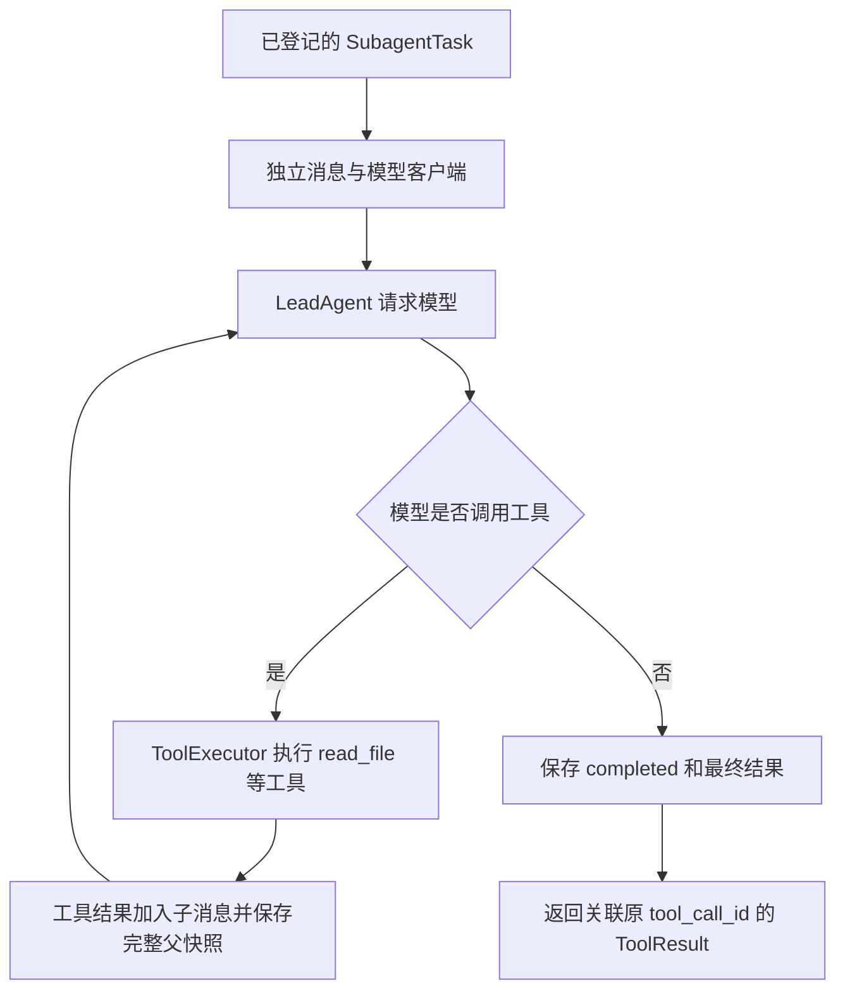

# 第二部分：让子任务真正执行

这一部分实现的功能是：后台把一项明确任务交给子 Agent；它可以调用现有真实工具，收到工具结果后继续请求模型，最后把结论交回来。执行中的完整消息和状态可以从 Checkpoint 重新读取。

现在可以通过 Python 调用执行器。聊天入口还没有注册 `task` 工具，所以主模型暂时不会自动委派任务；并发调度和前端子任务面板属于后续接入。

## 先对照 DeerFlow 的真实流程

远程源码根目录：`/home/pl/sp/deer-flow/backend/packages/harness/deerflow`。

| DeerFlow 源码 | 解决的问题 | Mini 保留的行为 |
| --- | --- | --- |
| `subagents/executor.py` 的 `_create_agent()` | 为子 Agent 建立模型、可用工具和执行循环 | 新建客户端，过滤工具，复用现有 `LeadAgent` 循环 |
| 同文件的 `_build_initial_state()` | 把委派任务变成子 Agent 的独立输入 | 子消息从工作单的 `prompt` 开始，不复制父对话全部历史 |
| 同文件的 `_aexecute()` | 执行、收集完整消息、确定结果 | 保存用户消息、模型工具决定、工具结果、最终消息及任务状态 |
| `tools/builtins/task_tool.py` 的 `_task_result_command()` | 把子结果关联回原工具调用 | 返回带原始 `tool_call_id` 的 `ToolResult` |
| `subagents/builtins/general_purpose.py` | 通用子 Agent 的提示词和工具限制 | 固定提示词保留原文，禁止再次委派、澄清及 `present_files` |

Mini 用 SQLite 保存完整父状态，其中 `subtasks` 保存子消息。这是适配现有 Mini 状态模型的做法，不能理解成 DeerFlow 原版也采用了相同的 SQLite 嵌套结构。本阶段使用 Python 的异步等待让多个任务交错进行，保留并发能力；没有搬入 DeerFlow 的全局线程池、专用事件循环及扩展系统。

## 从一次读文件任务理解

主 Agent 像负责人，把“读取 report.txt 并总结”写在工作单上；子 Agent 有自己的笔记本、自己的模型连接，但使用同一个 Thread 的文件工作区。



子任务的第一条用户消息、每条完整模型消息、每次工具结果和终态，都通过父 Runtime 的保存入口写入 Checkpoint。文字片段可以先实时发送，不能把“看见文字”当作“已经成功”。

## SubagentExecutor 的输入、输出与副作用

文件：`backend/app/subagents/executor.py`。每个父 Run 创建一个执行器，同一 Run 的子任务共用它。

- **功能**：把工作单变成一次真正的 Agent 执行；父 Runtime 继续管理 Run/Thread 状态、工作环境和流关闭。
- **输入**：
  - `parent_state`：当前父对话的完整状态。包含主消息和所有新旧子任务，保存时不能丢掉其中任意一部分。
  - `context.user_id`：任务属于谁，用于核对工作单归属。
  - `context.thread_id`：属于哪段对话，决定共享哪个文件工作区。
  - `context.run_id`：属于哪一次父执行，防止把旧 Run 的工作单放进当前 Run 执行。
  - `context.workspace_path`：工具可以操作的实际 Thread 工作目录。
  - `context.record_event`：发送实时事件并收集辅助日志；子执行器会加上子任务身份。
  - `context.save_checkpoint`：保存完整父状态。快照步骤编号仍由父 Runtime 分配。
  - `tool_registry`：父方当前已配置的真实工具。子方建立过滤后的新表，不修改父表。
  - `model_factory`：每次调用都创建一个新模型客户端的函数；不能把父模型客户端直接传给子方共用。
  - `timeout_seconds`：一次子 Agent 执行的等待上限，默认 120 秒。父 Run 的取消或总超时仍可以更早停止它。
  - `max_tool_rounds`：复用现有循环的轮数限制，默认 8；该循环的一轮是一次模型请求，最终回答也占一轮。
  - `thinking_enabled`：是否向子模型开启现有的思考功能，默认关闭。
  - `reasoning_effort`：模型支持时使用的推理强度，默认不指定。
  - `model_close_timeout`：清理模型连接的等待上限，默认 5 秒。
- **输出**：`execute(task)` 返回 `ToolResult`，其 `tool_call_id` 对应父方的那次委派调用。结果尚未自动加入父消息，调用方负责通过原有工具循环接回模型。
- **副作用**：请求模型、执行真实工具、经 Runtime 保存 SQLite 快照、发布子事件、更新内存工作单、关闭子客户端；不直接访问 SQLite Repository，不创建另一个 Run，也不归还父方工作环境或关闭父方 SSE。

下面假设 `task` 已经登记在 `state.subtasks`，`context` 来自当前父 Runtime，`registry` 是其工具表，`model_name` 是本 Run 使用的模型配置名：

```python
# 工厂每次创建一个客户端；使用同一种模型不等于共用同一个连接对象。
executor = SubagentExecutor(
    parent_state=state,
    context=context,
    tool_registry=registry,
    model_factory=ModelFactory(model_name).create_chat_model,
)

# await 表示此处等待结果；等待网络时，程序仍能处理其他任务和实时流。
result = await executor.execute(task)
```

`execute()` 的 `task` 输入是前一部分的 `SubagentTask`：

- `task_id`：后台工作单编号；必须是 `state.subtasks` 中的同一个对象。
- `tool_call_id`：原始父工具调用编号；结果靠它回到对应调用。
- `user_id/thread_id/run_id`：工作单所属用户、对话、父执行，必须与 `context` 一致。
- `description`：给过程事件使用的简短说明。
- `prompt`：子模型实际收到的完整任务和必要背景；父历史不会自动复制给它。
- `subagent_type`：当前只支持 `general-purpose`。
- `status/messages/result/error`：执行状态、独立消息、结果或错误。新的 `pending` 工作单必须尚未执行；函数会在关键状态保存成功后更新这些字段。

## 为什么同时运行也不会互相覆盖

两个子任务可以同时等待各自模型返回。调用方应把并发的 `execute()` 放进 `asyncio.TaskGroup`，也就是“一起启动、一起收尾的一组异步任务”：其中一个发生关键故障时，它会取消其他任务，并等待各自收尾，然后把异常交给父 Runtime。不能让父 Run 已经结束，子任务却仍在后台操作工作区。本阶段没有后台队列；执行器也不会自行决定启动几个任务。

需要保存时，它们共用一把异步锁：先拿到的任务把自己的消息合入**完整父状态的副本**，等待提交成功，再更新自己的内存工作单。另一个任务随后从更新后的父状态生成副本，所以不会拿旧状态覆盖第一个任务。

锁只保护合并与保存，不包住整个模型请求。每个子任务消息列表独立，模型客户端也独立。父对话在等待子任务时应继续保留同一个 `ThreadState` 对象；不能另外创建第二个执行器来同时管理同一批工作单。

文件工作区仍共享：两个子任务同时改同一个文件会产生冲突。后续的委派方应分配互不重叠的写入任务，不能把消息隔离误认为文件也隔离。

## 状态、取消和错误怎样处理

| 情况 | 子任务行为 | 调用方收到什么 |
| --- | --- | --- |
| 正常完成 | 保存完整消息和 `completed/result` | 成功的 `ToolResult` |
| 模型或执行失败 | 保存 `failed/error`，保留已取得的消息 | `is_error=True` 的结果，可交给父模型处理 |
| 达到子任务时间上限 | 保存 `timed_out` | 包含超时信息的失败结果 |
| 父任务取消或取消这个执行协程 | 保存 `cancelled`，关闭客户端 | 继续抛出 `CancelledError`，让父 Runtime 收尾 |
| 保存必要状态失败 | 不声称未保存的状态已经成功 | `StatePersistenceError` 越过工具层，父 Runtime 确认 Run 失败 |
| 再调用已经结束的同一张工作单 | 返回已保存的结果，不再执行工具 | 原结果或原失败信息 |
| 再调用 `running` 工作单 | 拒绝启动 | 明确异常；不会盲目重放可能已有副作用的工具 |

达到轮数限制时，Mini 记录失败并保留已取得的工具结果；尚未实现 DeerFlow 的 `stop_reason` 和“有部分结果也视作完成”的机制。进程重启后可以读取子任务历史，但本模块不自动重启遗留的 `running` 子任务。重新执行需要明确创建新的工作单。

取消发生在 SQLite 已经开始写入时，必须先等这一笔写入结束，不能让两个互相矛盾的收尾同时改库。如果 `completed` 已经提交，随后到来的取消不会把该子任务改成 `cancelled`；取消本身仍会交给父 Runtime。这里的超时不是强制杀进程的硬截止，必要的在途写入和有界连接清理仍需收尾。

如果错误状态也无法保存，查询到的子状态可能仍是最近确认的 `running`；应同时看父 Run 的真实终态，不能声称子错误状态已经入库。新的异常类型保留数据库异常；若原来已有模型异常或取消，它还保存在 `execution_error` 中。

## 其他新增接口

`build_subagent_prompt(tool_names)` 位于 `backend/app/subagents/prompts.py`：

- **功能**：为子模型提供 DeerFlow 的通用子 Agent 原始指令。
- **输入**：`tool_names` 是子工具表中实际可用的名称。
- **输出**：保留原文措辞的系统提示词字符串；删除不支持的文件编辑段落、自定义挂载说明，以及缺少对应工具时不适用的整句。
- **副作用**：只在内存中处理字符串，不读密钥、不访问网络、不写库。运行时的用户身份、文件清单等仍由已有 `WorkspaceContextMiddleware` 注入。

`close_chat_model(model, timeout_seconds)` 位于 `backend/app/model/lifecycle.py`：

- **功能**：释放本次 Agent 的模型连接，避免清理无限拖住取消。
- **输入**：`model` 是该 Agent 独占的客户端；`timeout_seconds` 是允许等待关闭的秒数。
- **输出**：成功返回 `None`；失败或超时抛出异常，由 `LeadAgent` 保留原执行错误优先。
- **副作用**：关闭网络连接；超时后请求取消关闭任务，保留引用观察后续异常，并用应用日志报告后续失败。它不写 SQLite，也不关闭父流。

`StatePersistenceError(message)` 位于 `backend/app/runtime/errors.py`：

- **功能**：让关键状态故障越过普通工具错误处理，防止父 Run 错报成功。
- **输入**：`message` 指出哪个必要状态未确认保存；`__cause__` 保留数据库错误，`execution_error` 可保留之前的模型错误或取消。
- **输出**：向父 Runtime 传播的异常对象。
- **副作用**：无；是否将 Run 保存为 `error`，仍由父 Runtime 决定并确认。

## 实时流和日志

子方沿用现有事件数据结构，使用独立事件名：

```text
subagent.text.delta / subagent.reasoning.delta
subagent.message.complete
subagent.tool.start / subagent.tool.end
subagent.status
```

每个事件携带 `task_id`、`parent_tool_call_id`、`description` 和 `subagent_type`。子工具自己的 `tool_call_id` 继续单独保留。

子文字和思考片段只实时发送；完整消息、工具过程和状态进入现有辅助日志。这样它们不会被现有前端当作主回答追加，后续可以接独立的子任务展示。

SQLite 的关键快照每步必须保存；辅助日志沿用现有的缓存、250 毫秒锁等待及有限重试。快速连续写快照时，辅助日志可能因锁竞争重试耗尽而告警并缺失，这不改变已保存的关键状态，也不把正常完成的 Run 改成失败。查看完整执行状态以 Checkpoint 为准。

## 验证方法与当前边界

使用临时数据库和真实 `read_file`，通过真实父 `AgentRuntime` 运行两个子任务，检查主消息、子消息、关联编号、快照步骤及 Run 终态。回归测试覆盖同时请求模型、重复启动、工具过滤、超时、重复取消、在途保存、数据库故障、模型连接关闭和父 Run 的错误传播。

生产主工具表仍只有此前实现的工具。执行器已经提供下一步可接入的后端接口，`task` 工具、同时执行数量的限制、任务队列和前端子任务显示尚未接入。
