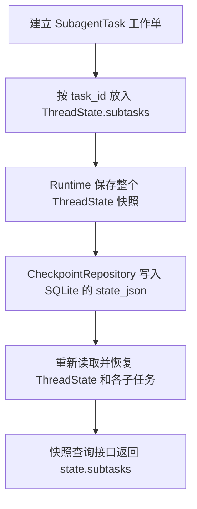

# 第一部分：保存子 Agent 的任务记录

这一部分给每个子 Agent 建立独立的“工作单”：它属于谁、谁委派了它、任务是什么、执行到哪里、读过哪些资料、得到了什么结果，都有明确的存放位置。以后查询历史步骤时，可以同时读回主对话和子任务的完整记录。

当前已经接入数据模型、SQLite Checkpoint 保存与恢复、快照查询响应。`task` 工具和并发执行器将在后续模块接入；现在普通对话的 `subtasks` 是空字典，这符合当前实现范围。

## 先对照 DeerFlow 的真实源码

远程参考项目位于 `/home/pl/sp/deer-flow`：

- `backend/packages/harness/deerflow/subagents/executor.py` 中的 `SubagentResult` 记录独立执行编号、模型调用关联、状态、结果和完整过程消息。
- `backend/packages/harness/deerflow/agents/thread_state.py` 中的 `DelegationEntry` 和 `ThreadState.delegations` 让主对话保存委派记录。
- `backend/packages/harness/deerflow/tools/builtins/task_tool.py` 把子任务结果转换为主 Agent 能继续处理的工具消息。

Mini 保留“独立任务身份、独立消息、状态、结果、主任务关联”。完整子任务记录放入 `ThreadState.subtasks`，随现有 SQLite 快照保存。这是适配 Mini 持久化目标的方案；DeerFlow 的内部记录形式与这里并不完全相同。

本模块不引入线程池、调度循环或模型调用。并发执行、超时取消、状态迁移和并发保存协调由后续执行器与 Runtime 负责。

## 一条记录如何流转



`messages` 与 `subtasks` 分工如下：

- `ThreadState.messages`：主 Agent 的消息。
- `ThreadState.subtasks[task_id].messages`：指定子 Agent 的消息，包括它发出的工具调用和收到的工具结果。

保存一份快照时，两部分一起保存；它们不会自动拼成同一份模型输入。

## SubagentTask：一张子任务工作单

源码：`/home/pl/deer_mini/backend/app/domain/subagents.py`。

- **功能**：表示一个子任务的身份、委派内容和执行记录，位于主 Agent 发出委派之后、子任务结果交回主 Agent之前。
- **输入**：下面列出的字段。任务归属由后台提供，任务说明来自主 Agent，状态和消息以后由执行器更新。
- **输出**：一个 `SubagentTask` 对象；调用 `to_dict()` 可以得到适合保存为 JSON 的普通字典。
- **副作用**：构造、校验和转换都只处理内存数据，不请求模型、不执行工具、不写 SQLite、不发送实时事件。

| 字段 | 真实含义 | 初始值或来源 |
|---|---|---|
| `task_id` | 后台标识这一次子任务的唯一编号 | 未指定时调用现有 `new_id()` 生成 |
| `tool_call_id` | 主模型发出的哪一次 `task` 调用；以后把结果交还给这次调用 | 后台从模型工具调用中取得 |
| `user_id` | 谁的任务 | 当前 Runtime |
| `thread_id` | 属于哪段对话 | 当前 Runtime |
| `run_id` | 属于哪一次主任务执行 | 当前 Runtime |
| `description` | 页面可以展示的简短任务名称 | 主 Agent |
| `prompt` | 交给子 Agent 的具体任务、背景和要求 | 主 Agent |
| `subagent_type` | 以后执行器选择哪份 Agent 配置 | 默认 `general-purpose`；本字段本身不会创建 Agent |
| `status` | 当前执行阶段 | 默认 `pending` |
| `messages` | 这个子任务的完整消息、工具调用和工具结果 | 独立的空列表 |
| `result` | 最终交回主 Agent 的文字结果 | 默认 `None`，即尚未填写 |
| `error` | 执行失败、取消或超时的说明 | 默认 `None` |

子任务沿用 DeerFlow 的六个状态名称：

| 状态 | 含义 |
|---|---|
| `pending` | 等待执行 |
| `running` | 正在执行 |
| `completed` | 执行完成 |
| `failed` | 执行失败 |
| `cancelled` | 已取消 |
| `timed_out` | 已超时 |

这些是子任务自己的状态；主 Run 继续使用项目原来的 `success`、`error`、`interrupted` 等名称。子任务完成不会自行把主 Run 改成成功。

`task_id` 与 `tool_call_id` 需要同时保留。例如两次不同的 Run 都收到模型生成的 `call_1`，后台仍会给它们生成两个不同的 `task_id`，让历史记录可以准确区分这两次执行。

`field(default_factory=list)` 的意思是“每次创建工作单，都新建一个消息列表”。这样给任务 A 添加消息时，任务 B 的消息不会跟着增加。任务编号的 `default_factory=new_id` 也是在每次创建对象时调用一次。

## 保存和恢复的方法

`SubagentTask.to_dict()`：

- **功能**：把一张工作单转换为普通字典，交给外层快照保存。
- **输入**：当前对象的所有字段。
- **输出**：包含原始任务编号、归属、状态、消息、结果和错误的字典；消息使用现有 `Message.to_dict()` 转换。
- **副作用**：无外部读写。发现无效状态、空任务身份等错误时抛出 `ValueError`。

`SubagentTask.from_dict(data)`：

- **功能**：从快照中的字典重建工作单。
- **输入**：`data`，即之前保存的任务字段和消息字典。
- **输出**：一个新的 `SubagentTask`，保留原来的 `task_id`、消息编号和工具调用关联。
- **副作用**：只创建内存对象；不会因为恢复记录而再次运行子任务。

`@classmethod` 表示这个恢复方法由类本身调用，如 `SubagentTask.from_dict(data)`，用读到的字段建立一个实例。它明确传入原来的 `task_id`，因此恢复时不会另发一个编号。

`Literal[...]` 描述允许的状态名称；Python 的类型标注本身不会阻止错误赋值，所以 `_validate()` 还会实际检查这些值。`__post_init__()` 在对象建立后校验一次，`to_dict()` 在保存前再校验一次。本模块只验证字段，不执行“只能从哪个状态进入哪个状态”的调度规则。

## ThreadState 如何接入

源码：`/home/pl/deer_mini/backend/app/domain/threads.py`。

- **功能**：同时容纳主 Agent 状态和完整子任务记录，作为 Runtime 每次保存的完整快照。
- **输入**：`thread_id` 和 `user_id` 指定对话归属；`messages` 是主对话消息；`workspace_path` 是当前对话工作目录；`subtasks` 是以 `task_id` 为键的工作单字典。
- **输出**：`to_dict()` 产生完整状态字典，`from_dict(data)` 从该字典恢复主对话与子任务对象。
- **副作用**：只有内存转换和归属校验；实际数据库写入仍在 `CheckpointRepository.save()` 中完成。

字典的键必须等于工作单的 `task_id`，子任务的用户和对话也必须与父状态相同。不同 Run 的历史子任务可以留在同一个 Thread 中，分别用各自的 `run_id` 识别。

旧 Checkpoint 没有 `subtasks` 字段，恢复时使用空字典。SQLite 原本就在 `checkpoints.state_json` 中保存整个状态，因此这次无需修改数据库表结构。

## 一段内存示例

下面示例只建立并恢复记录，不会调用模型或写数据库。输入是示例身份、任务说明和一条用户消息；输出是恢复后的子任务名称与消息。

```python
import json

from app.domain.messages import Message
from app.domain.subagents import SubagentTask
from app.domain.threads import ThreadState

# 后台身份与模型提供的任务说明组成一张工作单。
task = SubagentTask(
    tool_call_id="call_1",
    user_id="alice",
    thread_id="thread_1",
    run_id="run_1",
    description="查阅官方文档",
    prompt="读取 asyncio 官方文档，整理结论与来源。",
)
task.messages.append(Message(role="user", content=task.prompt))

# 用后台任务编号归档，保留它自己的消息列表。
state = ThreadState(thread_id="thread_1", user_id="alice")
state.subtasks[task.task_id] = task

# 模拟数据库使用的 JSON 转换，再恢复 Python 对象。
saved_text = json.dumps(state.to_dict(), ensure_ascii=False)
restored = ThreadState.from_dict(json.loads(saved_text))
print(restored.subtasks[task.task_id].description)
print(restored.subtasks[task.task_id].messages[0].content)
```

运行到第二次 `print` 时，读到的仍然是“读取 asyncio 官方文档，整理结论与来源。”。真正接入 Runtime 后，由它调用现有保存入口把完整 `state` 写入 SQLite；执行器更新某个子任务时也要通过受控入口合并，不能用子任务的局部消息覆盖整份主对话快照。

## 查询接口

源码：`/home/pl/deer_mini/backend/app/api/schemas.py` 的 `SubagentTaskResponse` 和 `ThreadStateResponse`。

- **功能**：让既有快照查询完整返回子任务记录。
- **输入**：Repository 已读回的子任务对象和父状态。
- **输出**：HTTP 响应中的 `state.subtasks`，包含每个子任务的完整字段与消息。
- **副作用**：校验、转换响应；不启动任务、不改变数据库状态。

沿用现有接口：

- `GET /api/threads/{thread_id}/state?user_id=...`
- `GET /api/threads/{thread_id}/runs/{run_id}/checkpoints?user_id=...`

已有用户归属检查继续生效。没有子任务时返回 `"subtasks": {}`。页面的并发进度展示需要后续执行器和事件接入，当前阶段先保证接口不丢失记录。

## 验证

从远程后端目录运行：

```bash
cd /home/pl/deer_mini/backend
.venv/bin/python -m pytest tests/app/domain/test_subagents.py tests/app/repositories/test_checkpoint_subagents.py tests/app/api/test_subagent_state.py -q
```

测试使用临时 SQLite 与工作目录，不请求模型或 Tavily，不创建生产测试对话。覆盖独立任务身份和消息、多份历史快照、完整工具消息关联、旧数据恢复、无效归属拒绝保存，以及查询接口和用户隔离。

查看本次改动时，可以先执行 `git status --short` 和 `git diff -- backend/app/domain/threads.py backend/app/api/schemas.py`。前者列出改动与新增文件，后者显示已跟踪文件的差异；新增文件需要直接打开阅读。本次未自动创建 Git 提交。
