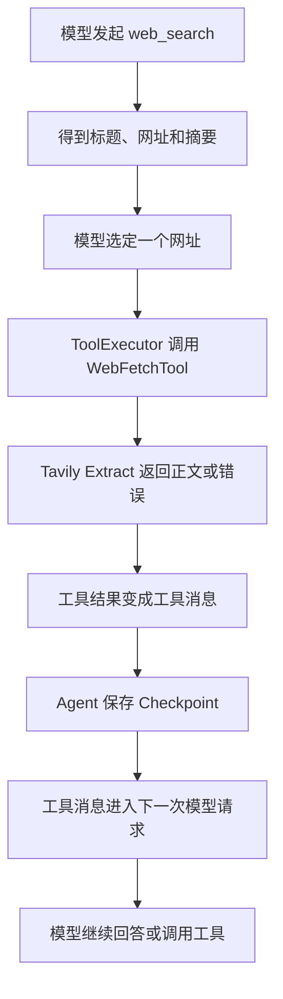

# 读取网页正文：web_fetch

现在你可以提出：“搜索 Python asyncio 官方文档，选一个网页读取正文，再根据正文总结。”页面会先显示“搜索网页”，然后显示“读取网页”，模型收到正文后继续回答。

## 从 DeerFlow 的真实实现开始

对应远程源码是 `/home/pl/sp/deer-flow/backend/packages/harness/deerflow/community/tavily/tools.py` 的 `web_fetch_tool(url)`。它通过 Tavily Extract 提取单个网址，先处理失败记录，再取第一条成功结果，返回标题和正文前 4096 个字符。

Mini 的实现位于 `/home/pl/deer_mini/backend/app/tools/web_fetch.py`，保留相同的核心行为、模型可见的工具说明和参数说明。它通过 Mini 已有的工具注册表和执行器接入，网络等待使用官方异步客户端。

## 模块的输入、输出和副作用

- **功能**：`WebFetchTool` 是“读取一页网页”的工具，位于模型选好网址之后、模型分析正文之前。
- **输入**：`__init__(api_key)` 接收后台访问 Tavily 的密钥。`execute(call, context)` 中，`call.id` 标识这一次读取请求，`call.name` 是 `web_fetch`，`call.arguments["url"]` 是要读的网址。`context` 带有当前用户、Thread、Run、工作目录、事件发布和状态保存入口；本工具遵守统一接口接收它，具体保存仍由外层执行流程完成。
- **输出**：`ToolResult` 把内容与原来的 `tool_call_id` 关联起来。成功时 `content` 为标题加正文前 4096 个字符；缺少标题时以请求网址作为标题。失败时返回错误说明并设置 `is_error=True`。`_error_result(call, message)` 负责统一包装错误、遮住密钥，并限制错误文字长度。
- **副作用**：构造对象和包装错误只是内存操作；执行读取会请求 Tavily 并使用提取额度。工具自身不写文件或 SQLite，也不直接推送页面事件。

## 一次真实调用怎样连接



原版关键调用是：

```python
res = client.extract([url])
```

`[url]` 表示“只含这一个网址的列表”。接口能接受多个网址，但当前工具每次只读取一个。Mini 对应的异步调用使用 `await client.extract(...)`：网络还在等待时，后端可以继续推送页面消息或响应取消操作。客户端用 `async with` 关闭连接，取消信号交回 Runtime 收尾。

## 哪些规则已经落在代码中

- 复用 `.env` 中的 `TAVILY_API_KEY`；密钥非空时，Coordinator 同时注册 `web_search` 和 `web_fetch`。
- 接收完整 HTTP/HTTPS 网址，拒绝空输入、无效端口和带用户名/密码的网址；不会擅自添加 `www` 或改写域名。
- 使用 basic 提取、Markdown 输出，单次最多等待 30 秒；正文最多返回 4096 个字符，这是截断，不是摘要。
- 抓取失败、空结果、空正文、密钥或额度问题、网络故障和超时都会交回工具错误消息。外层模型可以根据错误继续处理。
- 工具说明保留 DeerFlow 的“只能读取用户或工具给出的网址”等原文。当前代码检查网址格式，并没有另外建立网址来源校验器。
- 正文由第三方服务提取，页面需要登录或访问受限时可能读取失败；不具备网站登录、点击按钮或自动遍历链接的流程。
- `citations.py` 恢复了 DeerFlow 原版中要求在 `web_fetch` 后引用来源的那一行。保存过程和页面事件复用现有 Agent 流程。

## 验证方式

在远程后端目录执行受控测试，不消耗真实搜索或提取额度：

```bash
cd /home/pl/deer_mini/backend
.venv/bin/python -m pytest tests/app/tools/test_web_fetch.py tests/app/services/test_web_fetch_flow.py tests/app/services/test_run_coordinator_tools.py -q
```

这些测试覆盖请求内容、正文截断、失败分支、错误脱敏、超时和取消，以及“搜索→按返回网址读取→正文交回模型→SQLite 与实时流记录”的完整过程。

手动使用时，在页面输入：

> 搜索 Python asyncio 官方文档，选一个返回的网址调用 web_fetch 读取正文，然后用两句话总结并附上来源链接。

应能看到“搜索网页”和“读取网页”两个工具步骤；展开“读取网页”可查看实际 URL 和返回内容。
