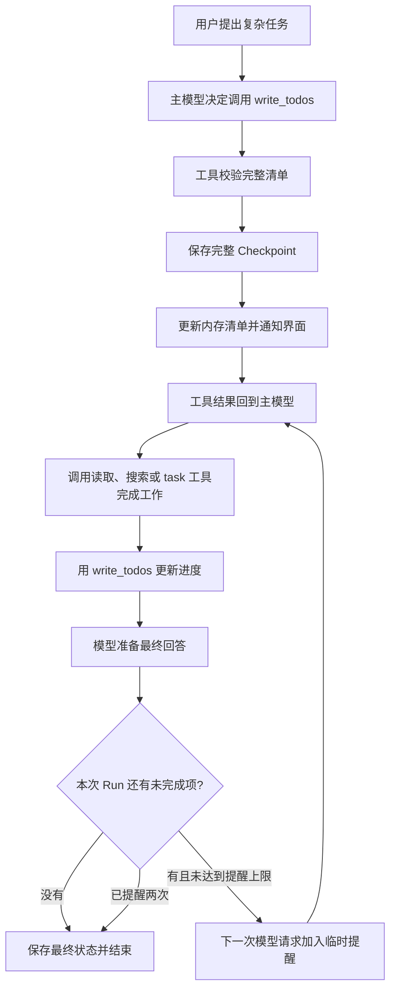

# 任务清单：让复杂工作的进度看得见

现在主 Agent 可以把工作拆成清单，并在处理过程中更新“待办、进行中、已完成”。刷新对话后，已保存的清单仍能从历史消息中显示。

先区分两件事：`write_todos` 负责记录计划和进度；真正的搜索、读取文件、委派工作，仍由 `web_search`、`read_file`、`task` 等工具完成。把“读取资料”写进清单，本身不会读取任何文件。

## 先对应 DeerFlow 的真实实现

参考项目位于 `/home/pl/sp/deer-flow`。以下路径相对于该项目：

| 源码位置 | 解决的问题 | Mini 中的对应实现 |
| --- | --- | --- |
| `backend/packages/harness/deerflow/agents/lead_agent/agent.py` 的 `_create_todo_list_middleware()` | 在计划模式启用清单工具，并提供系统提示、工具描述 | `app/agents/prompts/todo_list.py` 原样保存这两段提示 |
| `backend/packages/harness/deerflow/agents/middlewares/todo_middleware.py` 的 `TodoMiddleware` | 清单未完成时阻止模型过早退出，最多提醒两次 | `app/agents/todo_middleware.py` |
| 同一文件的 `_format_completion_reminder()` | 根据未完成项目生成继续提醒 | 原样复制提醒文字，只改变函数名和 Python 类型注解 |
| `TodoMiddleware` 继承的 LangChain `TodoListMiddleware` | 提供 `write_todos` 工具、清单状态以及同条回复重复写入的检查 | `app/tools/write_todos.py` 和 `app/domain/todos.py`，接入现有自定义工具接口 |

Mini 保留完整清单替换、真实状态保存、工具结果回到模型、未完成时继续提醒，以及同一条模型回复不能写入两份清单的行为。固定提示文字直接取自 DeerFlow，没有自行编写新的规划规则。

这里做了几项适配：主 Agent 默认可以使用该工具，仍由原版提示要求简单问题直接回答；暂不增加计划模式开关。每个 Run 都有自己的工具与提醒计数，所以不需要原版跨线程共享缓存。Mini 暂未压缩对话，因此不加入“压缩后重新注入旧清单”的功能。没有引入 LangChain 或 LangGraph。

## 一条真实执行链

例如用户说：“读取两份资料，比较差异，并给出结论。”



`Checkpoint` 可以理解成“给当前工作拍一张完整照片”：照片里同时有消息、工具调用、工具结果、子任务和清单。只保存清单文字，无法还原它在什么工作步骤发生，所以这里保存的是完整状态。

## 清单的数据

`app/domain/todos.py` 定义 `TodoItem`，`app/domain/threads.py` 把它放入 `ThreadState`。

- **功能**：保存一项工作做到了哪里，以及整张清单属于哪次执行。
- **输入**：`content` 是工作描述；`status` 是 `pending`、`in_progress`、`completed` 之一。`todos` 是完整列表；`todos_run_id` 是最后更新清单的 Run；`todos_tool_call_id` 是最后一次成功更新的工具调用编号。这两个编号由后台填写，用于识别取消前是否已经保存成功。
- **输出**：能转换为字典的清单和归属信息，供完整状态保存、恢复以及 API 查询使用。
- **副作用**：数据类只检查、转换内存数据，不读写 SQLite、不执行任务。已有快照缺少这些字段时，按空清单恢复，不需要改数据库表结构。

模型调用的参数只有下面这一项：

```json
{
  "todos": [
    {"content": "读取第一份资料", "status": "completed"},
    {"content": "读取第二份资料", "status": "in_progress"},
    {"content": "比较差异并总结", "status": "pending"}
  ]
}
```

每次传的是“更新后的整张清单”，不是只传改变的一行。少传的项目会被移除；传入 `[]` 会清空清单。工具会检查格式，但不会强制任务数必须大于等于三，也不会替模型判断工作是否真的完成；这些行为由原版提示引导。

## 工具如何保存

`app/tools/write_todos.py` 的 `WriteTodosTool` 是统一工具表中的一个真实工具。

- **功能**：在“模型提出清单”与“显示已确认进度”之间完成校验和保存。`bind()` 由执行钩子在 Runtime 恢复好状态后调用，建立本次 Run 的联系；`execute()` 处理一次实际更新。
- **输入**：`state` 是完整父对话；`call.id` 用于把结果对应回本次工具调用，`call.arguments.todos` 是整张新清单。`context.user_id` 表示谁的工作；`thread_id` 表示哪个对话；`run_id` 表示这次执行；`workspace_path` 表示这个对话的工作目录。`context.save_checkpoint` 允许保存完整状态，`context.record_event` 允许发布实时事件并收集辅助过程日志。模型不能自己传入这些后台身份。
- **输出**：带原调用编号的 `ToolResult`，其中 JSON 包含 `status: saved`、清单及所属编号；统一 `ToolExecutor` 把它转为工具消息交回模型。
- **副作用**：通过 Runtime 保存完整 Checkpoint，成功后更新内存，再发送 `todos.updated`。保存失败会抛出 `StatePersistenceError`，交给 Runtime 把 Run 收尾为错误；通知失败则记录应用警告，已保存的清单不回退。

关键的顺序是：

```python
# snapshot 是完整父状态的副本，里面已经替换为新清单。
await bound_context.save_checkpoint(snapshot)
# 只有上面确认成功，下面才更新正在执行的内存状态。
state.todos = deepcopy(todos)
```

`await` 表示等待保存完成时，程序可以先处理其他事情，比如向浏览器发送数据。用户也可能在这段时间点“停止”。因此 `finish_inflight()` 会等待已开始的保存与内存更新一起完成，再传递取消，避免数据库是新清单、内存却是旧清单。

如果保存成功后刚好被取消，`app/agents/tool_calls.py` 会用本 Run 和工具调用编号恢复已确认结果；没有确认保存的调用仍标为未确认，不自动重做。

## 为什么还需要 TodoMiddleware

`Middleware` 是执行流程中插入的钩子，可以理解成“每走到一个固定步骤，就经过一次检查”。它不直接操作数据库。

- **功能**：开始时绑定工具，请求模型前补入原版规划提示；模型准备直接结束时，检查本次计划是否还有未完成项。
- **输入**：已注册的 `WriteTodosTool`；`state.todos` 和 `todos_run_id` 用来判断本 Run 的进度；`context.run_id` 是当前执行身份；`messages` 是即将发给模型的请求消息；`message` 是本轮实际模型回复。
- **输出**：`prepare_model_messages()` 返回请求副本；`after_model()` 返回 `True` 时，`LeadAgent` 再请求一轮。`after_agent()` 清理尚未发送的临时提醒。
- **副作用**：只维护本次 Run 的提醒计数。继续提醒只放在下一次模型请求中，不加入 `ThreadState.messages`，不保存为用户消息，也不显示在聊天界面。

例如模型说“资料处理完了”，但清单仍有“整理结论：进行中”，钩子会用 DeerFlow 原版文字提醒它继续。模型的实际回复仍会正常保存和显示。提醒最多两次，达到上限后允许结束；未完成项目保留原状态，系统不会自动改为已完成。全局模型调用轮数上限仍然有效，提醒不会无限延长执行。

旧 Run 的未完成清单仍可查看，但不会强迫一个新问题继续旧工作。模型可以在新 Run 主动调用工具，重新确认或调整这张清单。

## 与并发和界面的关系

主 Run 注册 `write_todos`；子 Agent 的工具表过滤掉它。否则子 Agent 拿到的会是绑定父状态的工具，可能互相覆盖计划。

现有执行顺序继续生效：连续的 `task` 调用并发等待，整批子任务结束并合并状态后，再执行后续普通工具。`write_todos` 属于普通工具，因此它不会在子任务还在合并父状态时抢着更新清单。子任务保存的完整父快照也会保留当前清单。

`TodoList.tsx` 接收已校验的 `todos`，输出中文进度列表；`parseTodoResult()` 接收工具结果文字和当前工具调用编号，只接受 `status: saved`、编号匹配且格式有效的结果。它们只渲染界面，不写库、不更改任务状态。`AssistantProcess.tsx` 在“更新任务清单”步骤中显示列表；刷新后由已保存的工具消息重新展示。较早的清单更新仍位于折叠的历史步骤中。

## 验证和 Git

实际验证使用独立的临时数据库与资料文件，覆盖完整闭环、保存失败、取消时提交、最多两次提醒、旧 Run 隔离、子任务并发、API 历史查询和界面刷新。

验证中仍出现项目已有的辅助日志 SQLite 锁竞争警告，少量 `run_events` 可能未保存；清单、工具结果和最终状态的 Checkpoint 已确认保存。这项已有的日志问题需要单独处理，不能用实时界面出现了文字来推断所有过程日志都已落库。

在远程项目中查看本次变化可以运行 `git status --short`；它列出修改与新增的文件。然后用 `git diff -- 路径` 阅读已跟踪文件的逐行变化。当前项目还有先前未提交的开发内容，本次没有自动提交，避免把不同模块混在一个提交里。
